# CS336-Assignment1

## Targets

- Tokenizer(Byte-pair encoding (BPE) tokenizer)
- Architecture(Transformer language model )
- Train(The cross-entropy loss function and the AdamW optimizer)
- Util(dataloader , checkpoints , generate,etc .)
- [我的完整代码链接](https://github.com/ShallowU/cs336-assignment/tree/main/assignment1)（先完成再完美!!!）

## Tokenizer

### 1.如何实现bpe算法并用数据训练一个tokenizer？

**前置知识** Unicode，UTF-8，不同的分词器选择：词级(word)、字符级(character) 、字节级(byte) 、子词级(subword)，正则表达式，特殊标记。

**整体思路** 三步：初始化、预分词、迭代合并。

初始化：256个基础字节和special tokens。

预分词：使用正则表达式将一篇篇文档里的句子分成一个个chunk，每个chunk里应用bpe算法合并。eg：预分词的作用就是先进行一次清晰的切分, 告诉BPE：“goes 是一个独立的单元,’.‘是另一个独立的单元, 可以在goes 内部进行合并, 但绝对不能把goes的尾巴和. 合在一起。

迭代合并：频率最高的字节对，频率相同时, 采用选择字典序更大的对优先的原则即排在后面tokenid更大的先合并。

 **变量结构和含义示例：**

```
word_cnt = {
    (b'\x61', b'\x62', b'\x63'): 100,    # "abc" 出现 100 次
    (b'\x64', b'\x65'): 50               # "de" 出现 50 次
}

pair_cnt = {
    (b'\x61', b'\x62'): 150,  # ("a"+"b") 字节对出现 150 次
    (b'\x62', b'\x63'): 100,  # ("b"+"c") 字节对出现 100 次
}

vocab = {
    0: b'\x00',              # 基础字节 0-255
    255: b'\xff',
    256: b'<|endoftext|>',   # 特殊 token
}

merges = [
    (b'\x61', b'\x62'),  # 第 1 次合并：a+b→ab
    (b'\x62', b'\x63'),  # 第 2 次合并：b+c→bc
]
```

 **输入输出**
- 输入如下：
input_path: str 
vocab_size: int 
special_tokens: list[str]
- 输出如下：
vocab: dict[int, bytes] 
merges: list[tuple[bytes, bytes]] 

**详细思路**
拿到用special token分隔的数据文档后：

- 1.将数据读到一整个text中
- 2.用special token进行分隔成许多篇小文章组成的chunks
- 3.对每一篇文章chunk使用gpt-2分词形式分成类似一个个word形式，再将一个个word转换为字节存储。每一篇都是dict{wordbytes->cnt}格式,用list再将所有篇word dict转为一个整的word_cnt。为了加快速度，用process_map进行并行。word_cnt:dict{tuple(byte,byte,...)->int}
- 4.统计pair_cnt，pair_cnt: dict{tuple(byte,byte)->int}
- 5.构建初始词表0-255和special token,计算需要融合次数
- 6.每次找到频率最大的pair,合并为一个token，然后更新word_cnt,pair_cnt。比较复杂的是更新，需要注意时间复杂度。这里使用has这个flag判断一个word是否出现了max_pair，扫描完没有出现word_cnt按原样添加，pair_cnt不用变，因为pair_cnt初始就是从原pair_cnt赋值过来。但如果含有，则pair_cnt需要减去对应，并且将该word进行apply_merge进行融合，然后再添加合并后的word到word_cnt，以及更新pair_cnt。这里主要原理是如果maxpair未出现在该word中，则两者都不用变。出现了需要合并，重新添加。

细节注意点
- 1.用special token分隔文档时候，是否需要保留special token，多个special token需要按长度排序再应用split文档。
- 2.大部分时候用turple存储字节，用list增删查改再转为turple
- 3.对re.compile ,re.split的使用
- 4.存储vocab和merge是否字节以string形式存储，然后读出来需要ast转为字节

**代码：**

```python
def train_bpe(input_path,vocab_size,special_tokens):
    """
    Train a Byte Pair Encoding (BPE) tokenizer on the input text.

    This function implements the BPE algorithm to learn a vocabulary of a specified size
    by iteratively merging the most frequent pairs of tokens in the training data.

    Args:
        input_path (str): Path to the input text file to train on.
        vocab_size (int): The desired final vocabulary size, including special tokens.
        special_tokens (list): List of special tokens to be preserved during tokenization
            (e.g., ['<PAD>', '<UNK>', '<EOS>']).

    Returns:
        tuple: A tuple containing:
            - vocab (dict): A dictionary mapping token IDs to token strings. The first
              entries are basic vocabulary (bytes and special tokens), followed by
              merged tokens.
            - merges (list): A list of tuples representing the merge operations in order,
              where each tuple contains the pair of tokens that were merged.

    Process:
        1. Reads text from the input file
        2. Splits text by special tokens to preserve them
        3. Counts word frequencies in the corpus
        4. Counts pairs of adjacent tokens
        5. Iteratively merges the most frequent pair until vocab_size is reached
        6. Returns the final vocabulary and merge operations

    Note:
        - Uses parallel processing for large chunk counts (>= 4) to improve performance
        - The base vocabulary size is determined by basic tokens and special tokens
        - Number of merges = vocab_size - base_vocab_size
    """

    text = read_text(input_path)
    chunks = split_by_special(text,special_tokens)

    # Only parallelize if chunk count is big enough
    if len(chunks) < 4: word_dicts = list(map(count_word, chunks))
    else: word_dicts = process_map(count_word, chunks, chunksize=100)

    word_cnt = merge_dicts(word_dicts)
    pair_cnt = count_pair(word_cnt)

    vocab = get_basic_vocab(special_tokens)
    base_vocab_size = len(vocab)
    n_merges=vocab_size-base_vocab_size

    merges = []
    for i in range(n_merges):
        max_pair = get_max_pair(pair_cnt)
        vocab[base_vocab_size+i] = max_pair[0]+max_pair[1]
        merges.append(max_pair)
        word_cnt, pair_cnt = update_cnt_fast(word_cnt,pair_cnt,max_pair)
    return vocab, merges
```

### 2.如何构建一个tokenizer类用于token与string之间转换？

**前置知识** cls from file load, 贪心合并

**整体思路**

encode：处理special_token，Pre-tokenize (预分词)，Apply the merges (应用合并规则)

decode： ID to Bytes (ID 转字节序列)，Bytes to String (字节串转字符串)

 **变量结构和含义示例：**

```python
# 词表：token ID → 字节对象
vocab = {
    0: b'\x00',              # 基础字节 0-255
    255: b'\xff',
    256: b'he',              # 合并后的 token
    258: b'll',              # 合并后的 token
    266: b'<|endoftext|>',   # 特殊 token
}

# 反向词表：字节对象 → token ID（加速查询）
vocab_to_id = {
    b'\x00': 0,
    b'\xff': 255,
    b'he': 256,
    b'll': 258,
    b'<|endoftext|>': 266,
}

# 合并规则：有序的合并对列表（记录训练顺序）
merges = [
    (b'h', b'e'),      # 第 1 次合并：token ID 256
    (b'e', b'l'),      # 第 2 次合并：token ID 257
    (b'l', b'l'),      # 第 3 次合并：token ID 258
    ...
]

# 合并集合：快速查询某个对是否能合并
merges_set = {(b'h', b'e'), (b'e', b'l'), (b'l', b'l'), ...}

# encode 编码过程
text = "hello"
↓
tokens = [256, 258, 111]  # token ID 列表
# decode 解码过程
ids = [256, 258, 111]
↓
text = "hello"  # 字符串
```

**详细思路**

encode:
text = "hello, world <special_token> test "
  ↓ split_by_special (处理特殊 token)
chunks = ["hello","world"]  ["test"]
  ↓ split_to_words use GPT-2 pattern
word_list = ["hello"]
  ↓ word2bytes
word_bytes = (b'h', b'e', b'l', b'l', b'o')
  ↓ apply_merges (贪心合并),每轮循环每两个是否能合并，直到所有的都不能合并。
merged = (b'he', b'll', b'o')
  ↓ vocab_to_id (查表)
tokens = [256, 258, 111]

decode:
ids = [256, 258, 111]
  ↓ vocab (查表)
bytes_list = [b'he', b'll', b'o']
  ↓ b''.join (连接)
b'hello'
  ↓ .decode()
text = "hello"

**代码**

```python
class Tokenizer:
    """
    A Byte Pair Encoding (BPE) tokenizer with support for special tokens.
    This tokenizer converts text into sequences of token IDs using a vocabulary and merge rules.
    It supports special tokens that should not be merged during encoding.
    Attributes:
        vocab (dict[int, bytes]): Mapping from token IDs to byte sequences.
        merges (set[tuple[bytes, bytes]]): Set of valid merge pairs for BPE.
        special_tokens (list[str]): List of special token strings (e.g., ["<|endoftext|>"]).
        special_tokens_bytes (list[bytes]): UTF-8 encoded versions of special tokens.
        vocab_to_id (dict[bytes, int]): Reverse mapping from byte sequences to token IDs.
    Args:
        vocab (dict[int, bytes]): Dictionary mapping token IDs to byte sequences.
        merges (list[tuple[bytes, bytes]]): List of byte pair merge rules.
        special_tokens (list[str], optional): List of special tokens to preserve during tokenization.
		"""
    def __init__(self, vocab, merges, special_tokens=None):
        self.vocab = vocab
        self.merges = set(merges)
        self.special_tokens = special_tokens if special_tokens else []
        self.special_tokens_bytes = [i.encode('utf-8') for i in self.special_tokens]
        

        self.vocab_to_id={v:k for k,v in vocab.items()}

        # Ensure special tokens are in the vocabulary
        for token_bytes in self.special_tokens_bytes:
            if token_bytes not in self.vocab_to_id:
                # Add to vocab if not already present
                new_id = len(self.vocab)
                self.vocab[new_id] = token_bytes
                self.vocab_to_id[token_bytes] = new_id

    @classmethod
    def from_files(cls, vocab_filepath, merges_filepath, special_tokens=None):
        vocab = {}
        with open(vocab_filepath, "r", encoding="utf-8") as f:
            for line in f:
                idx, tok_str = line.strip().split("\t", 1)
                # 使用 ast.literal_eval 安全地解析字节字符串表示
                # 例如：把 "b'\\x00'" 转换为 b'\x00'
                vocab[int(idx)] = ast.literal_eval(tok_str)
        
        # 读取 merges
        merges = []
        with open(merges_filepath, "r", encoding="utf-8") as f:
            for line in f:
                parts = line.strip().split("\t", 1)
                if len(parts) == 2:
                    left = ast.literal_eval(parts[0])   # 将 "b'...'" 转为 bytes
                    right = ast.literal_eval(parts[1])  # 将 "b'...'" 转为 bytes
                    merges.append((left, right))
        return cls(vocab=vocab,merges=merges,special_tokens=special_tokens)

    def encode(self, text: str) -> list[int]:
        chunks = split_by_special(text, self.special_tokens, drop_special=False)
        tokens = []
        for chunk in chunks:
            if self.special_tokens and chunk in self.special_tokens:
                tokens.append(self.vocab_to_id[chunk.encode('utf-8')])
            else:
                tokens.extend(encode_merged(chunk, self.merges, self.vocab_to_id))
        return tokens

    def encode_iterable(self, iterable: Iterable[str]) -> Iterator[int]:
        """
        Given an iterable of strings (e.g., a Python file handle), return a generator that lazily yields token IDs. 
        This is required for memory-efficient tokenization of large files that we cannot directly load into memory.
        """
        for chunk in iterable:
            yield from self.encode(chunk)

    def decode(self, ids: list[int]) -> str:
        "Decode a sequence of token IDs into text."
        return b''.join([self.vocab[t] for t in ids]).decode('utf-8',errors='replace')
           
def apply_merges(word_bytes, merges_set, vocab_to_id):
  word_bytes = list(word_bytes)

  while True:
      min_token_id = float('inf')
      best_pair_idx = -1
      merged = None

      for i in range(len(word_bytes) - 1):
          pair = (word_bytes[i], word_bytes[i + 1])
          if pair in merges_set:
              combined = pair[0] + pair[1]
              token_id = vocab_to_id.get(combined)
              if token_id is not None and token_id < min_token_id:
                  min_token_id = token_id
                  best_pair_idx = i
                  merged = combined

      if best_pair_idx == -1:
          break

      # Apply best merge
      word_bytes = (
          word_bytes[:best_pair_idx]
          + [merged]
          + word_bytes[best_pair_idx + 2:]
      )

  return tuple(word_bytes)

def encode_merged(text,merges,vocab_to_id):
    word_list = split_to_words(text)
    tokens=[]
    for word in word_list:
        word_bytes=word2bytes(word)
        merged_word_bytes = apply_merges(word_bytes,merges,vocab_to_id)
        tokens.extend(vocab_to_id[i] for i in merged_word_bytes)
    return tokens
```

## 3.基本Tranformer Architecture从零手写实现

`Linear和Embedding层的实现`

- 都是实现一个类，有init初始化forward函数，权重都是二维参数，传入输入输出维度，以及device，dtype等
- nn.Parameter包装参数，并相应的进行std mean等初始化设置
- Linear的前向传播即矩阵乘法（注意乘法顺序转置），Embedding即取对应的token_id一行，是一个表。

`RMSNorm and LayerNorm`

- 属于一维参数，初始化为1用torch.ones()
- 最后一个维度进行norm即特征维度
- 注意dtype类型转换，先转为float32，最后结果再转为原dtype,防止计算溢出
- rmsnorm：y = weight * x  / sqrt(rms + eps) 
- layernorm：y = weight * (x - mean) / sqrt(var + eps) + bias

`SwiGLU`

- 先实现sigmoid，再实现silu，glu即是内积 对应元素相乘
- 三个线性层，w1经过后再经过silu作为权重分数(门控)，另一边经过w3，两者内积，再最后经过w2

`RoPE`

RoPE 是一种将位置信息编码到 attention 机制中的方法，通过对 query 和 key 向量应用旋转变换，使得两个 token 的内积自然包含它们的相对位置信息，从而实现外推性和计算效率的双重优势。具体来说，对于位置 m 的 token，我们将其向量在每个 2D 子空间中旋转 mθi 角度，其中 θi与维度 i相关。由于旋转矩阵的乘法性质，位置 m 和 n 的内积会自然包含相对位置 (n−m)的旋转，而不是绝对位置

- 1.初始化计算频率，用位置与频率外积获得位置频率表，再得到相应的cos表和sin表存起来，self.register_buffer使用

- 2.传入X例如Query及其对应的token_position，需要对其进行旋转

- 首先将位置带入对应的cos表和sin表得到旋转角度，将X分为奇数维度和偶数维度两部分,两两对应如下公式旋转

- ```
  # Apply the 2-D rotation to each pair
  out_even=x_even*cos_pos-x_odd*sin_pos
  out_odd=x_even*sin_pos+x_odd*cos_pos
  ```

- 最后再拼回一起返回即可

**为什么是上述计算公式呢？**

讲RoPE很清楚的视频： https://www.bilibili.com/video/BV12x42127Pb/?share_source=copy_web&vd_source=783046dd26b6d8ed3ae12d74958b0584

首先为什么需要位置编码？举例比如我爱你→ [”我”，“爱”，“你”] →经过transformer模型中最核心的attention计算后得到 [[1,2,3],[4,5,6],[7,8,9]]，但是你爱我→[”你”，“爱”，“我”]→经过计算[[7,8,9],[4,5,6],[1,2,3]]。发现这两者很相似，即“我” “你”在不同的句子计算后对应向量一样，只是位置不同。而本身我们希望是两者差别应该很大，每个字在不同的位置应该值就不同，而不是固定的。我们需要引入位置信息来进行计算，如何引入呢？

最开始是加法式绝对位置编码（无学习），每个位置固定信息，正余弦位置信息直接加在原来的计算结果上。后来是绝对位置编码可学习，即用了一个embedding table来学习位置，跟token embedding一样。但是上述都无法满足外推性，更长的序列只能被截断。接下来就是相对位置编码，运用乘法式旋转来模拟相对位置。即$x_i^{\prime}=x_ie^{im\theta}$，旋转的思想，复数进行实现简化。


向量写成复数形式，再利用欧拉公式展开最后化简。


上述证明是为了对每个token单独应用各自位置信息添加，其实可以用两两token一起用相对位置夹角进行计算。


扩展到多维度上，这里就是两两一组为一个平面使用其相对夹角进行旋转，所用一共有D/2个平面。


进行计算的时候可以进行简化，我们可以发现对于偶数行位置0，2，4等，偶数位置就是`out_even=x_even*cos_pos-x_odd*sin_pos`。

对于奇数位置则就是`out_odd=x_odd*cos_pos+x_even*sin_pos`。

当然工业界如llama实现的方式有一点差异，上述是两两配对，而llama是分为前半部分和后半部分。

导致改变的代码如下：

```python
# 把角度变成 cos 和 sin
# 工业界有个 trick：为了方便后续计算，我们把 cos 和 sin 复制两份拼接起来
# 形状从 [end, dim/2] 变成 [end, dim],因为后续计算不会分成even和odd两部分，所以位置最大就是max_len
emb = torch.cat((freqs, freqs), dim=-1)
```

```python
@staticmethod
def rotate_half(x):
    """
    这个辅助函数的作用是实现公式里的 (-y, x) 部分。
    假设输入 x 是 [x1, x2, ..., xd/2, y1, y2, ..., yd/2]
    """
    # 1. 把向量 x 最后一维切成两半
    x1 = x[..., : x.shape[-1] // 2] # 取前半部分 (相当于 x)
    x2 = x[..., x.shape[-1] // 2 :] # 取后半部分 (相当于 y)

    # 2. 拼接成 [-y, x]
    # 为什么是负号？因为旋转公式里有 (x*cos - y*sin)
    # 我们稍后会用 x * cos + (-y) * sin 来计算
    return torch.cat((-x2, x1), dim=-1)
```

```python
# 2. 应用旋转公式（一行搞定！）
# 公式: x_rotated = x * cos + rotate_half(x) * sin
# 这等价于:
#   - 前半部分: x_even * cos - x_odd * sin
#   - 后半部分: x_even * sin + x_odd * cos
return x * cos + self.rotate_half(x) * sin
```

`softmax`

- 先减去最大值防止exp溢出
- 一般sum max mean都keepdim=True，保持维度不变。

`ScaledDotProductAttention`

- 参数：初始化:d_k,前向传播参数：q,k,v,mask

- 注意缩放d_k,还有掩码的含义需要取反,这里query和key的变量seq写的不同，不过一般是相同的
- 公式：Attention(Q,K,V)=softmax(QK^T/sqrt(d_k))V

`CausalMultiHeadSelfAttention`

- 参数：初始化：d_model,num_heads,max_seq_len,use_rope,rope_theta,device,dtype，前向传播：x, token_positions

- 准备好rope ScaledDotProductAttention mask组件，是否使用rope：use_rope,四个线性层
- 三个线性层q k v重塑形状，增加num_head维度
- q k 经过rope添加位置信息，再经过缩放点积注意力
- 重塑形状删除num_head维度，最后经过一个输出投影

如果以直接方式实现，即不写ScaledDotProductAttention的MHA：

```python
  def forward(
      self,
      x: Float[Tensor, "batch seq_len d_model"],
      token_positions: Int[Tensor, "batch seq_len"]| None = None,
  ) -> Float[Tensor, "batch seq_len d_model"]:
      B,S,D=x.shape
      q,k,v,o_proj=[nn.Linear(D,D) for _ in range(4)]
      q=q.view(B, S, self.num_heads, self.d_k).transpose(1, 2)
      k=k.view(B, S, self.num_heads, self.d_k).transpose(1, 2)
      v=v.view(B, S, self.num_heads, self.d_k).transpose(1, 2)
      if self.use_rope:
          q,k=self.rope(q,token_positions),self.rope(k,token_positions)
      attn_scores=q@k.transpose(-2, -1)/math.sqrt(self.d_k)
      if  self.causal_mask is not None:
          attn_scores=attn_scores.masked_fill(~self.causal_mask[:,:,:S,:S],float("-inf"))
      attn_probs=torch.softmax(attn_scores,dim=-1)
      out=attn_probs@v
      out= out.transpose(1, 2).contiguous().view(B, S, D)       
      return o_proj(out) 
```

`TransformerBlock`

- 参数：初始化：d_model,num_heads,max_seq_len,use_rope,rope_theta,device,dtype加上d_ff,前向传播:x, token_positions

- ```
      Pre-norm Transformer block with two sub-layers:
  
         x ──► RMSNorm ──► MHA ──► + ──►
           │                     ▲
           └─────────────────────┘     (sublayer-1)
  
         y ──► RMSNorm ──► FF  ──► + ──► out
           │                     ▲
           └─────────────────────┘     (sublayer-2)
  ```

- pre-norm,残差连接

`TransformerLM`

- 参数：上述加上加上vocab_size，另外这里是context_length ,not max_seq_len，因为训练的数据不一定是整个满的batch

## 4.交叉熵，SGD AdamW，lr scheduling， gradient clip的实现

`cross_entropy`

- 公式：计算交叉熵损失：ℓ = -log(softmax(logits)[target_class])
- 减去最大值并使用log-sum-exp技巧提高数值稳定性。
- 优化后的公式：ℓ = log(∑_c exp(logits_c)) - logits_target_class

```python
def cross_entropy(logits,targets):
    vocab_size=logits.size(-1)
    logits=logits.view(-1,vocab_size)
    targets=targets.view(-1).to(torch.long)

    # 数值稳定性：减去每行最大值
    logits=logits-torch.max(logits,dim=-1,keepdim=True)[0]
    # log-sum-exp 技巧，shape:(N,vocab_size)-> (N,)
    log_sum_exp=torch.log(torch.sum(torch.exp(logits),dim=-1))
    # 选择目标类别的 logits
    # 这里使用二维的行索引与列索引，在二维矩阵中选取
    target_logits=logits[torch.arange(logits.size(0)),targets] 
    # 使用gather语法也可以，提取目标类别的 logit，但输出形状与 index 相同
    # 注意index shape应与logits一致二维，并且最终还要压缩还原为一维
    # target_logits=logits.gather(dim=-1,index=targets.unsqueeze(1)).squeeze(1)

    loss=log_sum_exp-target_logits # shape:(N,) - (N,)
    return loss.mean()
```

**优化器**

```
SGD (2012)
  ↓ 问题：收敛速度慢，容易陷入局部极值
  ↓
Momentum (2012)
  ↓ 问题：不同参数梯度大小差异大，学习率难以调整
  ↓
AdaGrad (2011)
  ↓ 问题：学习率单调递减，后期学习停滞
  ↓
RMSProp (2012, Hinton)
  ↓ 问题：一阶矩信息丧失，无法充分利用历史梯度
  ↓
Adam (2014) = Momentum + RMSProp + 偏差修正
  ↓
AdamW (2019) = Adam + 正确的权重衰减分离
```

`Momentum`

加速收敛，避免震荡

```
# 公式
m_t = β * m_{t-1} + (1 - β) * ∇L(θ_t)
θ_{t+1} = θ_t - lr * m_t
```

`RMSProp`

自适应学习率，不同参数独立调整，防止学习率衰减到0

```
# 公式
v_t = β * v_{t-1} + (1 - β) * (∇L(θ_t))²
θ_{t+1} = θ_t - lr * ∇L(θ_t) / (√(v_t) + ε)
```

`AdamW`

结合一阶矩和二阶矩，加上偏差修正；权重衰减解耦

```
# 公式
m_t = β₁ * m_{t-1} + (1 - β₁) * ∇L(θ_t)         # 一阶矩（动量）
v_t = β₂ * v_{t-1} + (1 - β₂) * (∇L(θ_t))²     # 二阶矩（RMSProp）
m̂_t = m_t / (1 - β₁^t)                         # 偏差修正
v̂_t = v_t / (1 - β₂^t)                         # 偏差修正
θ_{t+1} = θ_t - lr * m̂_t / (√(v̂_t) + ε) - λ * θ_t  # 权重衰减分离
```

以学习率可衰减SGD实现的代码算法思路为例：

```
首先optimizer.step()被调用，优化器将参数分为不同的组（param_groups）。

对于每个参数组group，获取其学习率 lr，即group["lr"]。

然后对于组内的每个参数 p：for p in group["params"]:

​    检查 p 是否有梯度（p.grad）。如果没有梯度，跳过该参数。

​    获取与参数 p 相关联的状态 state（self.state[p]）。

​    从状态中获取迭代次数 t（state.get("t", 0)），如果没有则初始化为0。

​    获取参数 p 的梯度 grad（p.grad.data）。

​    使用 SGD 更新公式更新参数 p 的值：p.data -= lr / math.sqrt(t + 1) * grad。

​    将迭代次数 t 增加1，并将其存回状态中（state["t"] = t + 1）。

最终返回损失值（如果提供了 closure）
```

那么AdamW的实现就是模版一样了，只是更加了更多相关参数计算，比如beta weight_decay eps 


```python
class AdamW(torch.optim.Optimizer):
    def __init__(self, params, lr=1e-3, betas=(0.9,0.999), weight_decay=1e-2, eps=1e-8):
        if lr < 0:
            raise ValueError(f"Invalid learning rate: {lr}")
        defaults = {"lr":lr, "beta": betas, "weight_decay": weight_decay, "eps": eps}
        super().__init__(params, defaults)
    def step(self):
        for group in self.param_groups:
            lr = group['lr']
            beta = group['beta']
            weight_decay = group['weight_decay']
            eps = group['eps']
            for p in group['params']:
                if p.grad is None:
                    continue
                state = self.state[p]
                m = state.get("m", torch.zeros_like(p.grad))
                v = state.get("v", torch.zeros_like(p.grad))
                m = beta[0] * m + (1 - beta[0]) * p.grad.data
                v = beta[1] * v + (1 - beta[1]) * p.grad.data ** 2
                t = state.get("t",1)
                lr_t = lr * ((1 - beta[1] ** t) ** 0.5) / (1 - beta[0] ** t)
                p.data -= lr_t * m / (v ** 0.5 + eps)
                p.data -= lr * weight_decay * p.data
                state["m"] = m
                state["v"] = v
                # 注意这里要自增1
                state["t"] = t + 1
```

`lr_cosine_schedule`


`Gradient clipping`

训练时候有些batch反向传播可能梯度值很大，影响训练稳定，我们需要在optimizer.step之前进行缩放。

```python
    total_norm = 0
    for param in parameters:
        if param.grad is not None:
            total_norm += ((param.grad.data) ** 2).sum().item()
    total_norm = total_norm ** 0.5
    if total_norm > max_l2_norm:
        scale = max_l2_norm / (total_norm + 1e-6)
        for param in parameters:
            if param.grad is not None:
                param.grad.data = param.grad.data * scale
    return total_norm * scale if total_norm > max_l2_norm else total_norm
```

## 5.训练过程中的数据加载、checkpoint的保存与加载、训练循环主体怎么写？

`data loader`

最开始参考的是nanogpt、gpt-2的数据加载方式，也就是andrej karpathy所用的，写一个batch加载的类，这种是按顺序取片的：

维护一个self.current_position,每次取完一个batch，就会跳转一个batch长度，轮到下一次取的起始位置。整个设计很优雅。

```python
class BatchIterator:
    def __init__(self, data, batch_size, context_length, device="cpu"):
        """
        基于流式读取的 BatchIterator
        逻辑参考：nanoGPT / GPT-2 standard data loader
        """
        self.data = data # 预期是 mmap 的 numpy array
        self.B = batch_size
        self.T = context_length
        self.device = device
        self.current_position = 0
        self.total_len = len(data)
        
        print(f"BatchIterator initialized: {self.total_len:,} tokens.")

    def get_batch(self):
        B, T = self.B, self.T
        
        # 1. 边界检查：如果剩余数据不够一个 Batch，则重置 (Epoch 结束)
        # 我们需要 B*T + 1 个 token (因为要有 target)
        if self.current_position + B * T + 1 > self.total_len:
            self.current_position = 0
            print("Epoch finished, resetting to start of data.")
            
        # 2. 提取 Buffer
        # 从长流中直接切出一大块：大小为 B*T + 1
        buf = self.data[self.current_position : self.current_position + B * T + 1]
        
        # 3. 转换为 Tensor 并移至 GPU
        # 注意：先转 int64 确保兼容 Embedding 层
        buf = torch.from_numpy(buf.astype(np.int64)).to(self.device)
        
        # 4. 构建 Input (x) 和 Target (y)
        # buf[:-1] 是 0 到 BT-1
        # buf[1:]  是 1 到 BT
        # .view(B, T) 将一维流折叠成二维 Batch
        x = buf[:-1].view(B, T)
        y = buf[1:].view(B, T)
        
        # 5. 推进指针
        # 下一次读取从当前这一块的末尾开始，绝不重叠
        self.current_position += B * T
        
        return x, y
```

当然官方实现的更加简洁，也就是使用随机的采样，而不是按顺序采样：

```python
def get_batch(data,batch_size,context_length,device="cpu"):
    total_len=len(data)
    idx=np.random.randint(0,total_len-context_length,batch_size)

    inputs=np.array([data[i:i+context_length] for i in idx])
    targets=np.array([data[i+1:i+1+context_length] for i in idx])

    return (
        torch.from_numpy(inputs).to(device),
        torch.from_numpy(targets).to(device)
    )
```

```
np.load(args.train_data, mmap_mode='r')
```

为防止数据太多太大，使用mmap_mode='r'按需加载。

`Checkpointing`

为了能中断训练后接着继续训练，我们需要保存中间的参数，包括模型参数、优化器参数、训练轮次。

而如果是训练的最终产物用于推理，保存模型参数就够了。

```python
def save_checkpoint(
        model:torch.nn.Module,
        optimizer:torch.optim.Optimizer,
        iteration:int,
        path:str
):
    save_dict={
        "model_state_dict":model.state_dict(),
        "optimzer_state_dict":optimizer.state_dict(),
        "iteration":iteration
    }
    torch.save(save_dict,path)
```

```python
def load_checkpoint(
    src: str ,
    model: torch.nn.Module,
    optimizer: torch.optim.Optimizer | None=None, # 推理时候不用optimizer
):
    state_dict=torch.load(src,map_location="cpu")
    
    model_state=state_dict["model_state_dict"]
    if any(k.startwith("_orig_mod.") for k in model_state.keys()):
        model_state = {k.replace('_orig_mod.', ''): v for k, v in model_state.items()}
    model.load_state_dict(model_state)

    if optimizer is not None:
        optimizer.load_state_dict(state_dict['optimizer_state_dict'])
    return state_dict['iteration']
```

`Training loop`

```
训练数据 → BatchIterator → (64, 256) → TransformerLM → (64, 256, 10000)
                ↓                              ↓
            输入序列 x                      logits预测
                ↓                              ↓
            目标序列 y ← ← ← ← ← ← ← CrossEntropy → loss标量
                                               ↓
                                          loss.backward()
                                               ↓
                                          梯度 → 裁剪 → AdamW更新step
```



```mermaid
flowchart TD
    Start([开始训练]) --> ParseArgs[解析命令行参数<br/>vocab_size, d_model, batch_size等]
    ParseArgs --> DeviceCheck{检查设备}
    DeviceCheck -->|CUDA可用| GPU[device = 'cuda']
    DeviceCheck -->|MPS可用| MPS[device = 'mps']
    DeviceCheck -->|都不可用| CPU[device = 'cpu']
    
    GPU --> Setup
    MPS --> Setup
    CPU --> Setup
    
    Setup[创建输出目录<br/>保存配置文件] --> InitModel[初始化模型<br/>TransformerLM<br/>4层, 512维, 16头]
    
    InitModel --> LoadData[加载数据<br/>train.npy mmap模式<br/>val.npy mmap模式]
    
    LoadData --> CreateIterator[创建BatchIterator<br/>batch_size=64<br/>context_length=256]
    
    CreateIterator --> InitOptim[初始化优化器<br/>AdamW<br/>max_lr=1e-3]
    
    InitOptim --> InitLogger[初始化日志<br/>TensorBoard Writer<br/>tqdm进度条]
    
    InitLogger --> LoopStart{step < total_iterations?<br/>20000步}
    
    LoopStart -->|否| SaveFinal[保存最终检查点<br/>checkpoint_final.pt]
    SaveFinal --> End([训练结束<br/>打印总耗时])
    
    LoopStart -->|是| CalcLR[计算学习率<br/>Cosine Schedule<br/>Warmup 1000步]
    
    CalcLR --> UpdateLR[更新优化器学习率<br/>param_group lr = lr]
    
    UpdateLR --> GetBatch[获取训练批次<br/>x, y = iterator.get_batch<br/>shape: 64×256]
    
    GetBatch --> Forward[前向传播<br/>logits = model x<br/>shape: 64×256×10000]
    
    Forward --> CalcLoss[计算损失<br/>loss = cross_entropy logits, y<br/>标量]
    
    CalcLoss --> Backward[反向传播<br/>optimizer.zero_grad<br/>loss.backward]
    
    Backward --> ClipGrad[梯度裁剪<br/>max_norm = 5.0<br/>防止梯度爆炸]
    
    ClipGrad --> OptimStep[参数更新<br/>optimizer.step]
    
    OptimStep --> LogMetrics[记录指标<br/>loss, lr, grad_norm<br/>tokens_per_sec]
    
    LogMetrics --> CheckSave{step % 5000 == 0<br/>且 step > 0?}
    
    CheckSave -->|是| SaveCheckpoint[保存检查点<br/>checkpoint_step.pt<br/>model + optimizer + step]
    CheckSave -->|否| CheckVal
    SaveCheckpoint --> CheckVal
    
    CheckVal{step % 200 == 0?}
    
    CheckVal -->|是| ValMode[切换到评估模式<br/>model.eval]
    ValMode --> ValLoop[验证循环 50次<br/>no_grad模式]
    ValLoop --> GetValBatch[获取验证批次<br/>batch_size=32]
    GetValBatch --> ValForward[验证前向传播<br/>logits = model x_val]
    ValForward --> ValLoss[计算验证损失<br/>val_loss]
    ValLoss --> CollectLoss[收集损失值<br/>val_losses.append]
    CollectLoss --> ValCheck{完成50次?}
    ValCheck -->|否| GetValBatch
    ValCheck -->|是| AvgLoss[计算平均损失<br/>mean val_losses]
    AvgLoss --> LogVal[记录验证指标<br/>TensorBoard]
    LogVal --> TrainMode[切换回训练模式<br/>model.train]
    TrainMode --> IncrStep
    
    CheckVal -->|否| IncrStep[step += 1<br/>更新进度条]
    
    IncrStep --> LoopStart
    
    style Start fill:#e1f5e1
    style End fill:#ffe1e1
    style Forward fill:#e1e5ff
    style Backward fill:#ffe5e1
    style SaveCheckpoint fill:#fff3e1
    style ValLoop fill:#f0e1ff
    style GetBatch fill:#e1f5ff
```

## 6.Generating text部分

```python
def generate_stream(
    model, 
    tokenizer, 
    prompt,
    max_tokens=256,
    temperature=1.0,
    top_p=0.9,
    top_k=0,
    device='cuda',
    eos_token_id=None
):
    """
    流式生成文本,逐 token yield
    
    Yields:
        str: 每次生成的单个 token 解码后的文本
    """
    model.eval()
    
    input_ids = tokenizer.encode(prompt)
    input_ids = torch.tensor([input_ids], dtype=torch.long, device=device)
    # input_ids shape: (1, seq_len)
    
    if eos_token_id is None:
        eos_token_id = tokenizer.vocab_to_id.get(b"<|endoftext|>", None)
    
    with torch.no_grad():
        for _ in range(max_tokens):
            context_length = getattr(model, 'context_length', 256)
            # 截断到模型的 context_length
            context = input_ids[:, -context_length:]
            
            logits = model(context)
            next_token = choose_next_token(logits, temperature, top_p, top_k)
            
            if eos_token_id is not None and next_token == eos_token_id:
                break
            
            # 实时解码并 yield 单个 token
            token_text = tokenizer.decode([next_token])
            yield token_text
            
            next_token_tensor = torch.tensor([[next_token]], dtype=torch.long, device=device)
            input_ids = torch.cat([input_ids, next_token_tensor], dim=1)
```

挑选下一个token如下函数：

```python
def choose_next_token(logits, temperature, top_p, top_k):
    """
    temperature: 温度参数，控制采样的随机性
    top_p: 累积概率阈值
    top_k: top-k 采样的 k 值
    先top-k，再top-p
    使用torch.multinomial进行采样
    """
    next_token_logits = logits.squeeze()[-1]
    # next_token_logits.shape = (10000,)
    # 这是第 256 个位置对应的 10000 个词的 logits

    # 如果温度为0，直接返回最大概率的token（贪心解码）索引
    if temperature == 0:
        return torch.argmax(next_token_logits).item()
    
    # 应用温度缩放，如果 temperature > 1，分布更平坦，更创造；如果 < 1，分布更陡峭，更保守
    next_token_logits = next_token_logits / temperature
    
    # Top-k 采样：只保留概率最高的k个token
    if top_k > 0:
        # 获取top-k的值和索引
        top_k_values, top_k_indices = torch.topk(next_token_logits, min(top_k, next_token_logits.size(-1)))
        # 创建一个mask，只保留top-k的logits
        logits_mask = torch.full_like(next_token_logits, float('-inf'))
        logits_mask[top_k_indices] = top_k_values
        next_token_logits = logits_mask
    
    # 计算概率分布
    probabilities = torch.softmax(next_token_logits, dim=0)
    
    # Top-p 采样（Nucleus Sampling）
    if top_p < 1.0:
        # 按概率从大到小排序
        sorted_probs, sorted_indices = torch.sort(probabilities, descending=True)
        # 计算累积概率
        cumulative_probs = torch.cumsum(sorted_probs, dim=0)
        # 找到累积概率超过top_p的位置
        cutoff_index = torch.where(cumulative_probs > top_p)[0]
        if len(cutoff_index) > 0:
            # 保留累积概率在top_p范围内的token
            cutoff_index = cutoff_index[0].item() # 第一个超过top_p的索引
            # 创建新的概率分布，只保留累积概率在top_p范围内的token
            nucleus_probs = torch.zeros_like(probabilities)
            # 将累积概率在top_p范围内的token的概率赋值给新的概率分布
            nucleus_probs[sorted_indices[:cutoff_index + 1]] = sorted_probs[:cutoff_index + 1]
            # 重新归一化
            nucleus_probs = nucleus_probs / nucleus_probs.sum()
            probabilities = nucleus_probs
    
    # 从概率分布中采样
    next_token = torch.multinomial(probabilities, num_samples=1).item()
    
    return next_token
```

## 7.训练过程遇到的报错问题

### 7.1数据类型问题

Embedding实现中：训练过程索引一定得是整型long，因为取每一行的数据，防止可能隐式转换为float
```python
    def forward(self, token_ids: torch.Tensor) -> torch.Tensor:
        # 强制转换为 long (int64) 类型，防止传入 float 导致报错
        token_ids = token_ids.to(torch.long)
```

cross_entropy实现也是同样道理，索引只能是整型

```python
    # 【关键修改】强制转换为 long (int64)
    targets=targets.view(-1).to(torch.long)
```

### 7.2 维度shape问题

RoPE的实现中：由于少了对多头维度的考虑，存储的cos sin表要增加一个维度才能匹配：

```python
        # Gather the cached tables for the required positions
        # [Batch, Seq] -> [Batch, Seq, Dim] -> unsqueeze -> [Batch, 1, Seq, Dim]
        cos_pos = self.cos_cached[token_positions].unsqueeze(1)
        sin_pos = self.sin_cached[token_positions].unsqueeze(1)
```

cross_entropy实现:使用gather后维度还是二维需要降维，否则会产生(N,N)大矩阵很占显存，这里vocab_size 10000,即(10000，10000)

```python
    # 提取目标类别的 logit，输出形状与 index 相同
    target_logits=logits.gather(dim=-1,index=targets.unsqueeze(1))

    # 【关键修复】将 (N, 1) 变为 (N)，防止广播成 (N, N)
    target_logits = target_logits.squeeze(-1)
    loss=logexpsum-target_logits
```

### 7.3 数据loader问题

在上述数据加载中有顺序取和随机取，在 其他训练配置相同下，但训练loss曲线却有很大差异：

| random get batch                                        | sequence batch iterator                                     |
| ------------------------------------------------------- | ----------------------------------------------------------- |
|  |  |

可以看到随机的取训练很稳定，而按顺序取却幅度很大。
BatchIterator 的顺序读取特性：

- 同一个 batch 内的所有样本来自连续的文本片段
- 如果 TinyStories 数据集按故事组织，每个 batch 可能只包含 1-2 个故事的片段
- 不同 batch 之间的主题、词汇、语法风格差异很大

随机采样的均匀性：

- 每个 batch 的样本来自整个数据集的不同位置
- 样本多样性高，梯度更稳定
- Loss 的方差更小

```
[Story 1: "Once upon a time, a little girl..."]  ← 简单句式，常见词汇
[Story 2: "The dragon soared through the sky..."] ← 复杂词汇，长句
[Story 3: "Tim and Sam played in the park..."]   ← 对话多，短句
```

### 7.4加速训练

```python
torch.set_float32_matmul_precision('high') # TF-32
model=torch.compile(model)
```

--------------------------------------------------

最终在tinystories上我的val loss只达到了1.47，尽管我尝试了很多学习率以及warm up策略。


## 参考文档

- https://github.com/stanford-cs336/assignment1-basics/tree/main
- https://github.com/weiruihhh/cs336_note_and_hw
- https://github.com/Sherlock1956/TransformerFromScratch
- https://zhuanlan.zhihu.com/p/1935209292715241716
